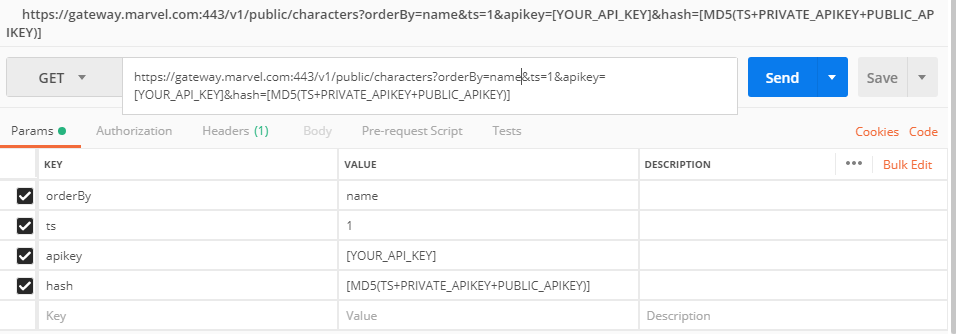
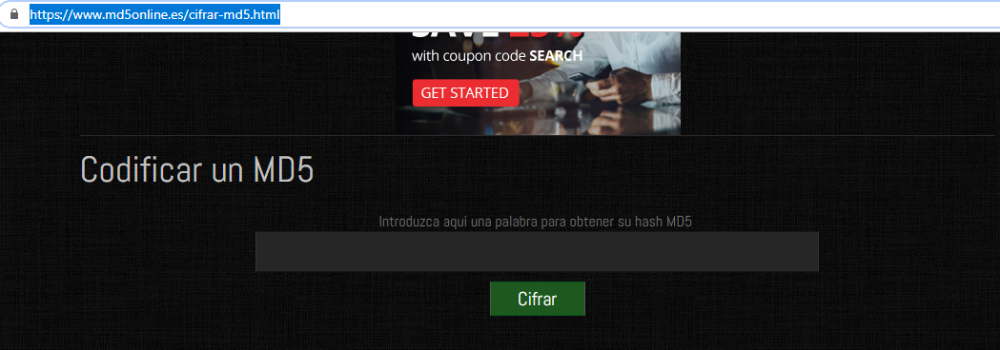
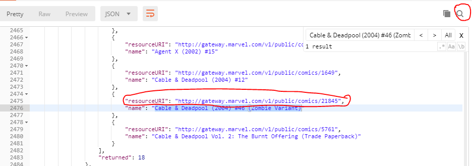

# Challenge C02
## RESTful APIs and HTTP requests
* Download postman and get information for a superhero from Marvel API  
* Access to https://developer.marvel.com/docs and do all steps to get an API key to get access
* Get information related to the list of characters of Cable & Deadpool (2004) #46 (Zombie Variant)
* Get a list of all stories when Agent X (Nijo) appears
* Generate JSON document with this information and push to GitHub repo

## How to do that?
1. [Download POSTMAN here and install it](https://www.getpostman.com/apps)
***
2. Get an API key for Marvel developers [signing up here](https://developer.marvel.com/signup)
***
3. Now, we want to find all the characters in the comic "Cable & Deadpool (2004) #46 (Zombie Variant)" so we need the id of that comic to find that, so firstable we do a general search following the next steps
  

  * Use the link bellow https://gateway.marvel.com:443/v1/public/characters
  * As parameters add orderBy = name; ts = 1; apikey = [your public apikey]; hash = [your hash]
  * To get your public apiKey follow the second step.
  * To get your hash you need to use the ts, your public apikey and your private apikey with the next notation:
      If I want to use a ts of 1, my private apikey is "abc" and my public apikey is "123" your hash will be 1abc123 converted to MD5 -  (md5(tsprivatepublic))
      To do that you can search md5 on google or follow this URL https://www.md5online.es/cifrar-md5.html
      
      * in that field you need to add your tsprivatepublic (e.g. 1abc123)
      * Take the generated key and use it as your hash in POSTMAN
  ***
  * Now, using the response, we will search for "Cable & Deadpool (2004) #46 (Zombie Variant)"
    
  * We will take that url, adding /characters at the end to get all the characters in that comic and adding the same parameters as we did above.
  ***
  [See the JSON response here](Cable%26Deadpool46.json)
***
4. Now that we know how to make a request to the Marvel API, we will do the same to search all stories when Agent X (Nijo) appears
 * Here we can just search for that specific name with this URL https://gateway.marvel.com:443/v1/public/characters?name=Agent%20X%20(Nijo)&orderBy=name (and adding the ts, public and hash values)
 * Or, if we need a more specific response, we will use the next URL with the id of that character: https://gateway.marvel.com:443/v1/public/characters/1011031/stories (and adding the ts, public key and hash)
 ***
 [See the JSON response here](AgentXstories.json)

## About Me
I'm Alejandro Taborda, from Medellín - Colombia, and I am studying systems engineering in the seventh semester on EAFIT University.
*E-mail:* atabord@hotmail.com
