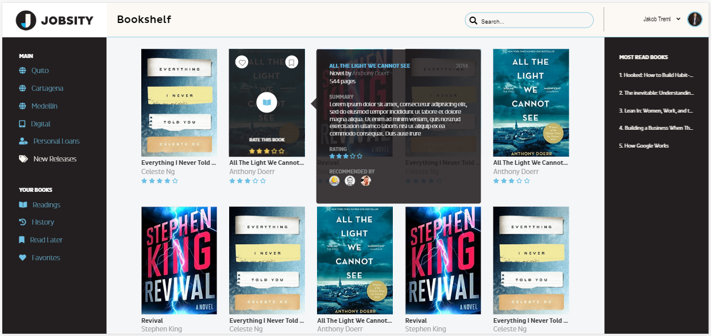
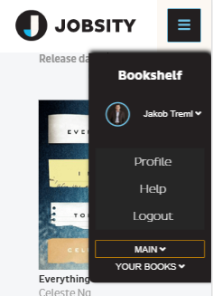

#Challenge C03
##Layout and styling
* Generate the layout in HTML and CSS files, the project with the proposed design.
* Follow all the CSS guidelines and make it responsive
* Push the layout to the GitHub repo

## How I did that?
During this week generated a layout in HTML and CSS completely responsive with a little interactivity made with jQuery.
This interactivity help the page showing some pupups and navigation menu as bellow:

## Watch it runing in your device:
https://atabord.github.io/JSSchool/ChallengeC03/
