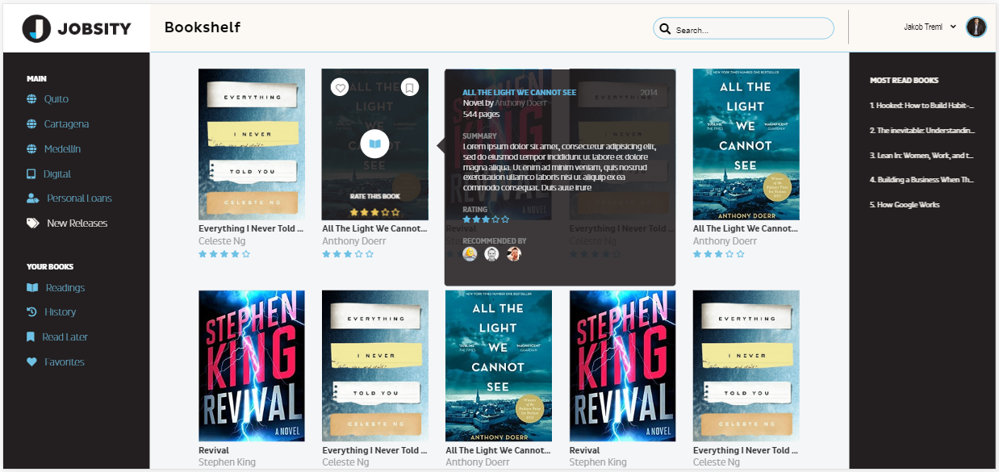
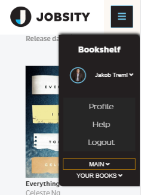

# Challenge CO5
## Homepage for the final project

* Interact with the API for books which provide information of the books
* Use the endpoint: https://www.googleapis.com/books/v1/volumes?q=isbn:9781451648546, to get book information
* Create the model in JSON file to use as mocked data
* Start building the main layout for the site in a normal index.html file using SCSS and js to get the first prototype of the app with mocked data
* Create homepage of the bookstore app
* Create book preview page
* Create reservation process interface
* Finally, add into your GIT repo and push all the new elements

## How I did that?
During this week generated a layout in HTML and SCSS completely responsive with a little interactivity made with jQuery.
This interactivity help the page showing some pupups and navigation menu as bellow:

## Watch it runing in your device:
https://atabord.github.io/JSSchool/ChallengeC05/

