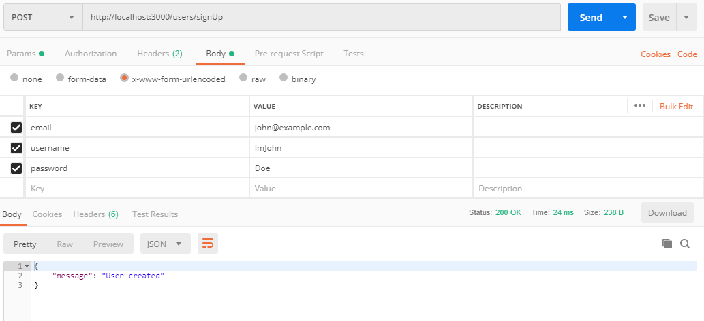
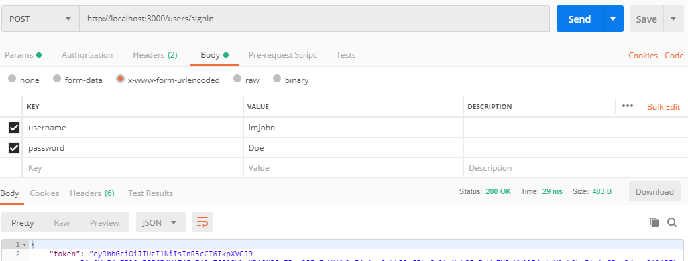
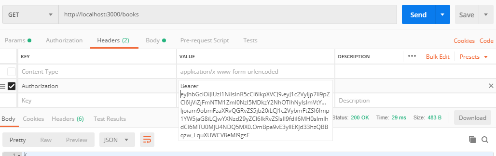
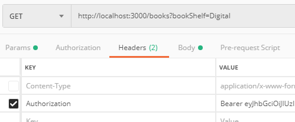
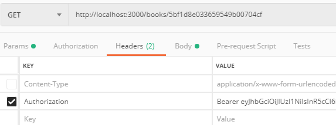
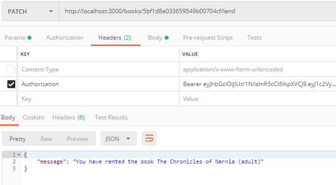

# Challenge CO6
## Backend endpoints

* Generate a backend rest service with the necessary endpoints to use in the application
* Integrate MongoDB to save all reservations

    Detailed specs:
    - Create some JS code to populate MongoDB with books information.
    - Create a method to return all books. This method could receive a QUERY parameter to filter the books by bookShelf: Quito, Medellin, Digital, etc….
    - Create a method to return the info of 1 book.
    - Create a method to lend a Book. This method should validate the book is not lent.
    - The backend should Have users.
    - Create a login endpoint for a user to authenticate and receive a token
    - All the endpoints except Login are secured. Use a JWT approach
    - Create a Detailed Readme on how to run the backend

* Create at least 3 endpoints to be consumed
* Use express architecture to mount all services
* Push all changes to your GitHub repo

## How to Install and use the API
### prerequisites
  * clone the repository
  * Install the dependencies:
    ```
        npm install
    ```
  * Set your own environmental variables in the file .env
  * download MongoDB, install it, open a terminal and run:
    ```
        mongod
    ```
  * To autofill the database:
    ```
      npm run populate
    ```
  
  * Run the project with:
    ```
        npm start
    ```

  * Preparing the environment: 
  
    open .env file and change the values when required, the environment is already setted with default values for developers

### Sign Up
    Call `/users/signUp` using post and bringing information as follows:

| key   | value |
| ----- | ----- |
| email  | an unique email (e.g. john@email.com) |
| username | an unique username |
| password | an unique password |



### Sign In
    Call `/users/signIn` using post and bringing information as follows:

| key   | value |
| ----- | ----- |
| username | your created username |
| password | your created password |



### Now, use your token to access the following endpoints ad bellow:

Remember to use Bearer prefix, espace and then your token



### Populating MongoDB
    Call `/books/new` with Post method and the next body:

| key   | value |
| ----- | ----- |
| isbn  | [Find the isbn of your favourite book here](https://isbnsearch.org/) |
| place | Can be Quito, Cartagena, Medellin, Digital or Personal Loans |
| copies | Number (e.g. 3) |

 Example in Postman:
 

* Note: don't forget to pass your token through headers

### Get All the books
    Call `/books` with Get method and your token in the header info.

### Get All the books in a specific bookShelf
    Call `/books?bookShelf=[bookshelf wanted]` with Get method and your token in the header info.

  

### Get one book
    Call `/books/[book id]` with Get method and your token in the header info.

    That id is specified in the returned json, you can find them while getting all the books



### Lend a book
    Call `/books/[book id]/lend` with PATCH method and your token in the header info.

 * I decided to make it with PATCH method because when you have rented it, the available copies will be reduced by one
 * You can't lend a book with no available copies unless it is digital

 