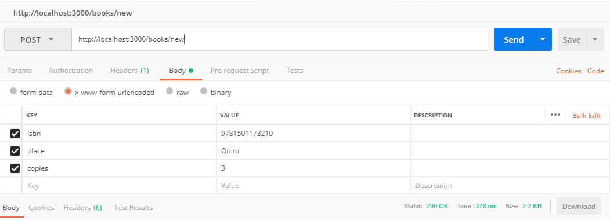

# Challenge CO6
## Backend endpoints

* Generate a backend rest service with the necessary endpoints to use in the application
* Integrate MongoDB to save all reservations

    Detailed specs:
    - Create some JS code to populate MongoDB with books information.
    - Create a method to return all books. This method could receive a QUERY parameter to filter the books by bookShelf: Quito, Medellin, Digital, etc….
    - Create a method to return the info of 1 book.
    - Create a method to lend a Book. This method should validate the book is not lent.
    - The backend should Have users.
    - Create a login endpoint for a user to authenticate and receive a token
    - All the endpoints except Login are secured. Use a JWT approach
    - Create a Detailed Readme on how to run the backend

* Create at least 3 endpoints to be consumed
* Use express architecture to mount all services
* Push all changes to your GitHub repo

## How to Install and use the API
### prerequisites
  * clone the repository
  * Install the dependencies:
    ```
        npm install
    ```
  * Set your own environmental variables in the file .env
  * download MongoDB, install it, open a terminal and run:
    ```
        mongod
    ```
  * Run the project with:
    ```
        npm start
    ```
### Populating MongoDB
    Call `/books/new` with the next body:

| key   | value |
| ----- | ----- |
| isbn  | [Find the isbn of your favourite book here](https://isbnsearch.org/) |
| place | Can be Quito, Cartagena, Medellin, Digital or Personal Loans |
| copies | Number (e.g. 3) |

 Example in Postman:
 